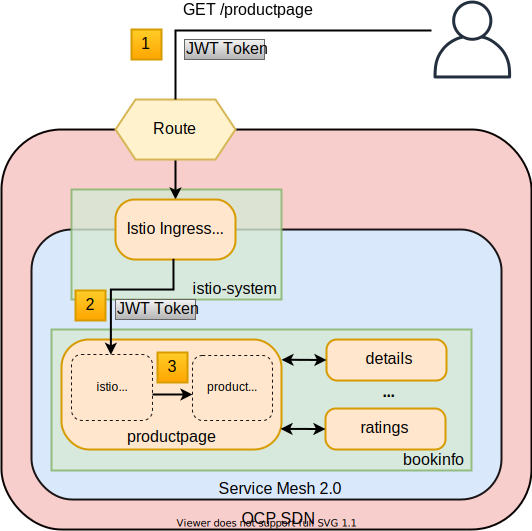
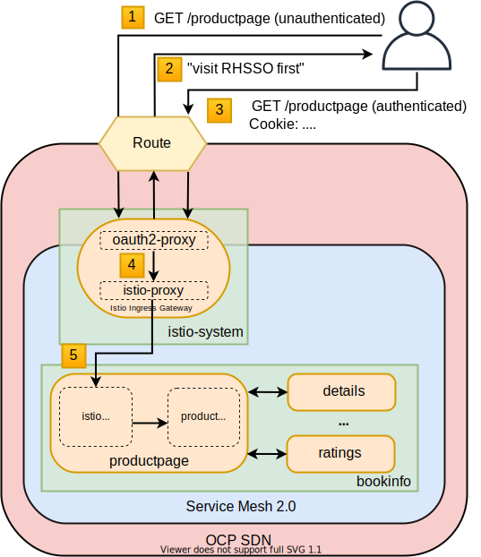
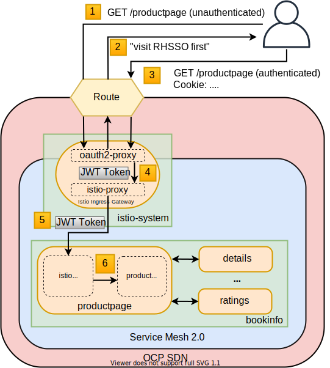

# servicemesh-2-rhsso-examples

Openshift Service Mesh 2.0 provides an easy way to connect microservices in a secure and consistent manner, and to build distributed, modulable and scalable applications on top of it.

Connecting microservices and securing these connections is rather simple thanks to custom ressources such as VirtualService and DestinationRule. But what about securing the access to the resulting applications?
In an enterprise context, it might be desirable to have some high-level filtering - complementary to network-based filtering - regarding which users or teams can access which applications. 

Istio - the control plane of Openshift Service Mesh 2.0 - provides natively some mechanisms for such filtering, based on a JSON Web Token (JWT) that a user would embed in a cookie when requesting an application. However, the retrieval and the embedding of the JWT is left to the user, and no native mechanism exists yet to provide a full automated workflow.

In this repository, we go through these native authentication/authorization mechanisms, and explore a way to implement a full automated workflow based on OIDC. Red Hat Single Sign-On (RHSSO) is used as the authentication/authorization entity. All the code and more detailed READMEs for each approach are available in the corresponding subdirectories.

This tutorial assumes a running OCP 4 cluster (>= 4.6) and cluster-admin user are available.

For the sake of simplicity, it is better to delete and re-create the istio control plane and the bookinfo application when trying the different approaches below.

## Prerequisites

* have Service Mesh 2.0 installed
* have a RHSSO platform inside the cluster deployed using the RHSSO operator
* have bookinfo service mesh application example deployed 

## Approach 1: Using Istio native mechanisms for JWT-based authorization

In this approach, access to the `bookinfo` application is restricted using Istio-related CRD [RequestAuthentication](https://istio.io/latest/docs/reference/config/security/request_authentication/) and [AuthorizationPolicy](https://istio.io/latest/docs/reference/config/security/authorization-policy/) deployed in the cluster. A user can access the application by providing a JWT token in its HTTP request (through the HTTP Header `Authorization`).

The workflow is as follows:

0. the user authenticates to RHSSO and get a JWT token (not shown in the above picture);
1. the user performs an HTTP request to `https://<route>/productpage` and passes along this request the JWT token;
2. the Istio ingress gateway (default one) forwards the request and the JWT token to the istio-proxy container of the productpage pod;
3. the istio-proxy container of the productpage pod checks the validity of the JWT token depending on the `RequestAuthentication` and `AuthorizationPolicy` objects deployed beforehand;
4. if the JWT token is valid, user accesses `/productpage` - otherwise, an error message is returned to the user (code 404, message "RBAC denied" or others).

### Pros:
* the simplest approach (only 2 CR to be deployed)
* fine-grained authorization based on JWT token fields

### Cons:
* no OIDC workflow: the user must get a JWT token on its own, and pass it with the HTTP request on its own
* need to define `RequestAuthentication` and `AuthorizationPolicy` objects for each application to protect inside the service mesh

## Approach 2: Injecting oauth2-proxy container inside the Istio ingress gateway to implement an OIDC workflow

In this approach, access to the `bookinfo` application is restricted by injecting an oauth2-proxy sidecar container to the Istio ingress gateway. The oauth2-proxy will enforce user authentication with RHSSO before forwarding any request to the istio-proxy (the default container of the Istio ingress gateway). In this approach, the OIDC workflow between the user, oauth2-proxy and RHSSO is perfomed automatically. 

The workflow is as follows:

1. the user performs an unauthenticated HTTP request to `https://<route>/productpage`;
2. the oauth2-proxy inside the Istio ingress gateway pod initiates the OIDC workflow to authenticate the user; user authenticates to RHSSO (not shown on the picture);
3. the user performs an authenticated HTTP request to `https://<route>/productpage`; the authentication is checked by the oauth2-proxy using HTTP cookies;
4. the oauth2-proxy forwards locally (same pod) the request to the istio-proxy container of the Istio ingress gateway, which in turn forwards the request to the istio-proxy container of the productpage pod;
5. user accesses `/productpage`.

### Pros:
* authentication enforced at the ingress gateway level (no need to define `RequestAuthentication` and `AuthorizationPolicy` objects for each application)
* automated OIDC workflow to authenticate the user

### Cons:
* coarse-grained authorization (authenticated == authorized)
* complex setup (involve patches)

## Approach 3: Combining JWT-based authorization and OIDC workflow

This approach combines the use of `RequestAuthentication` and `AuthorizationPolicy` objects as done for approach 1, and the injection of the oauth2-proxy container as done in the approach 2. In this approach, the oauth2-proxy container extracts the JWT token from the authentication cookie, and forwards it to the istio-proxy container alongside the HTTP request (using the `X-Forwarded-Access-Token` HTTP header). As a result, an automated OIDC workflow to authenticate the user is performed, and can be, if needed, combined to a fine-grained authorization based on JWT token fields (e.g. simple auth for 'non-secure' apps, auth + JWT field for more secure apps).

The workflow is as follows:

1. the user performs an unauthenticated HTTP request to `https://<route>/productpage`;
2. the oauth2-proxy inside the Istio ingress gateway pod initiates the OIDC workflow to authenticate the user; user authenticates to RHSSO (not shown on the picture);
3. the user performs an authenticated HTTP request to `https://<route>/productpage`; the authentication is checked by the oauth2-proxy using HTTP cookies;
4. the oauth2-proxy extracts the JWT token from the authentication cookie and forwards it locally (same pod) alongside the HTTP request to the istio-proxy container of the Istio ingress gateway;
5. the istio-proxy container of the Istio ingress gateway forwards the request and the JWT token to the istio-proxy container of the productpage pod;
6. the istio-proxy container of the productpage pod checks the validity of the JWT token depending on the `RequestAuthentication` and `AuthorizationPolicy` objects deployed beforehand;
7. if the JWT token is valid, user accesses `/productpage` - otherwise, an error message is returned to the user (code 404, message "RBAC denied" or others).

### Pros:
* authentication enforced at the ingress gateway level
* automated OIDC workflow to authenticate the user
* if needed, fine-grained authorization based on JWT token fields

### Cons:
* complex setup (currently involves deployment / service / route patches)

# References
* [Blog Openshift: Design Considerations at the Edge of the ServiceMesh](https://www.openshift.com/blog/design-considerations-at-the-edge-of-the-servicemesh)
* [Service mesh patterns repository](https://github.com/trevorbox/service-mesh-patterns/tree/master/ossm-2.0/auth)
* [Hints about how to debug istio](https://labs.consol.de/development/2020/05/07/debugging-istio.html)
* [oauth2-proxy repository](https://github.com/oauth2-proxy/oauth2-proxy)
* [oauth2-proxy integration with RHSSO](https://oauth2-proxy.github.io/oauth2-proxy/docs/configuration/oauth_provider/#keycloak-auth-provider)
* [Istio RequestAuthentication](https://istio.io/latest/docs/reference/config/security/request_authentication/) 
* [Istio AuthorizationPolicy](https://istio.io/latest/docs/reference/config/security/authorization-policy/) and [conditions](https://istio.io/latest/docs/reference/config/security/conditions/)
* [RHSSO operator documentation](https://access.redhat.com/documentation/en-us/red_hat_single_sign-on/7.4/html/server_installation_and_configuration_guide/operator)
