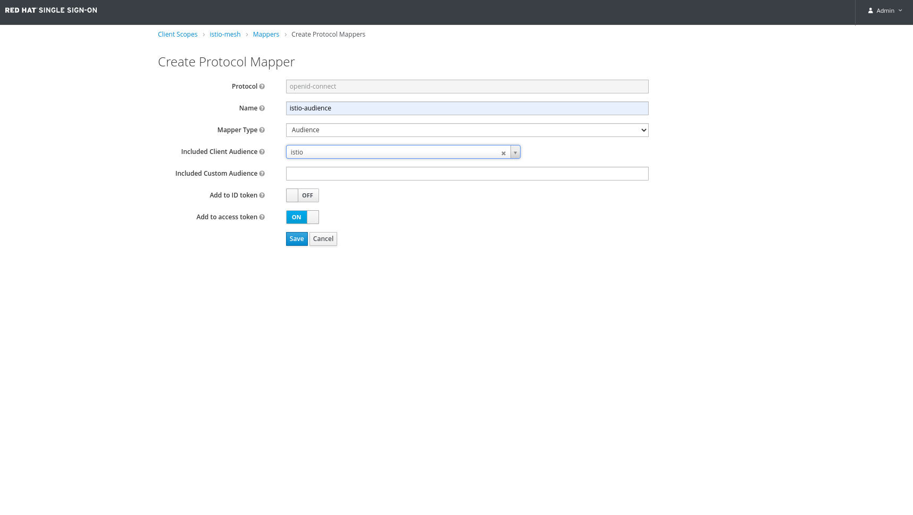
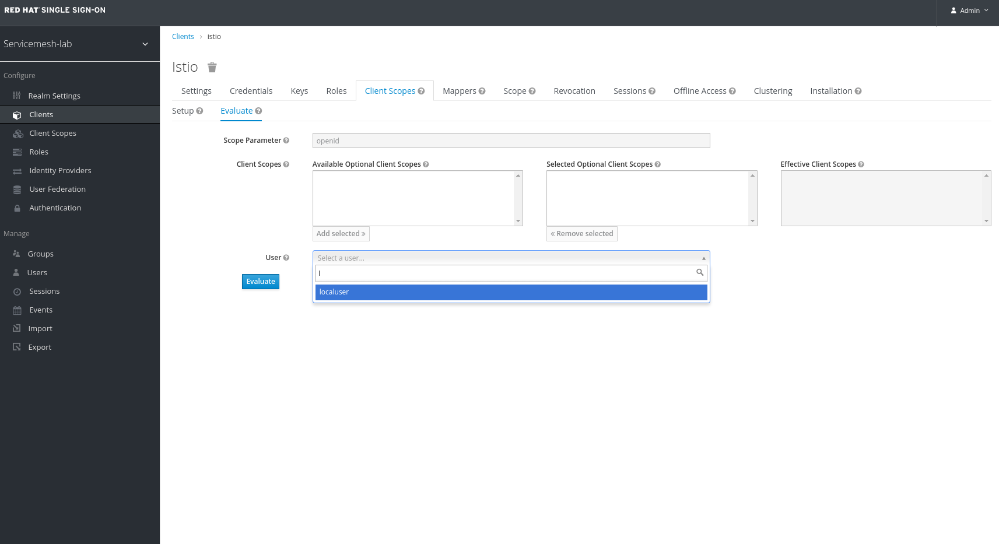
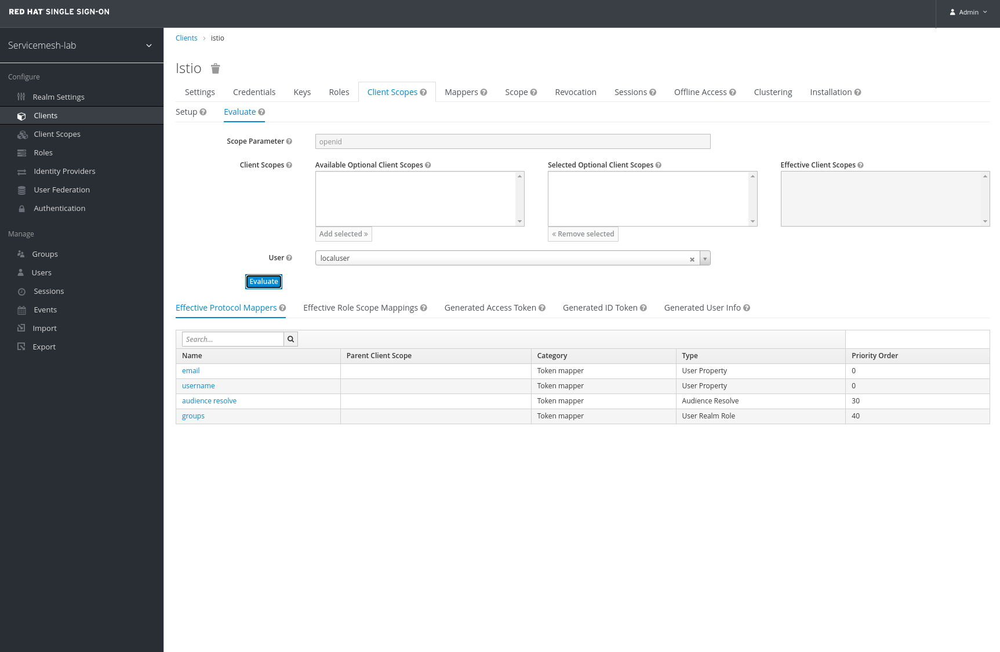

# Prerequisites

## Adapt the YAML files to match cluster name and base domain

Assuming your cluster API FQDN is `api.myocp.my.domain.com`:

```
$ find . -type f -name "*.yaml" |xargs sed -i 's@<CLUSTERNAME>@myocp@g'
$ find . -type f -name "*.yaml" |xargs sed -i 's@<BASEDOMAIN>@my.domain.com@g'
```

## Install Service Mesh 2.0

You can follow [the official documentation for Service Mesh 2.0](https://docs.openshift.com/container-platform/4.6/service_mesh/v2x/installing-ossm.html) until the section [Deploying the control plane from the web console](https://docs.openshift.com/container-platform/4.6/service_mesh/v2x/installing-ossm.html#ossm-control-plane-deploy-operatorhub_installing-ossm). When creating the `ServiceMeshControlPlane` object, you can leave all the fields to their default values.

## Install bookinfo application
You can follow [the official documentation for deploying bookinfo](https://docs.openshift.com/container-platform/4.11/service_mesh/v2x/ossm-create-mesh.html) from step 1 to step 13 (apply `bookinfo-gateway.yaml`) included.

You can test that bookinfo is correctly installed using:
```
$ export GATEWAY_URL=$(oc -n istio-system get route istio-ingressgateway -o jsonpath='{.spec.host}')

$ curl -I http://$GATEWAY_URL/productpage
HTTP/1.1 200 OK
```

## Deploy RHSSO using the RHSSO operator
We'll deploy a very simple, non-prod ready, RHSSO platform using the RHSSO platform. This RHSSO platform can be enhanced later to use a remote database (e.g. Amazon RDS), run multiple instances and use identity provider such as Github.


1. Create the `rhsso` namespace:
```
$ oc new-project rhsso
```

2. Install the RHSSO operator in the `rhsso` namespace by following [the official documentation](https://access.redhat.com/documentation/en-us/red_hat_single_sign-on/7.4/html/server_installation_and_configuration_guide/operator#install_by_olm)


3. Create the RHSSO deployment:
```
$ oc apply -f rhsso/01_rhsso.yaml 
```

4. Create the `servicemesh-lab` realm:
```
oc apply -f rhsso/02_servicemesh-realm.yaml
```

5. Create a client `istio` inside the realm `servicemesh-lab`.

Note:
* the field `secret` is set randomly and you can leave as it is (we'll used this secret later);
* even if the route matching the `redirectUris` is currently using `http` (the route of the Istio default ingress gateway), leave `https` in the `redirectUris` field (the route will be patched later in approach 2 and 3);
``` 
$ oc apply -f rhsso/03_istio-client.yaml
```
Currently, the RHSSO operator does not allow to set the client to `confidential`, so we have to set it manually using the web UI.
```
# Retrieve the admin user password
# Note: the password itself is a base64 string
$ oc get secret credential-rhsso-simple --template={{.data.ADMIN_PASSWORD}} -n rhsso | base64 --decode

# Retrieve the root
$ oc get route keycloak -n rhsso
```
Open the route in a browser (don't forget `https://`) and login using the user `admin` and the above password. 
Then, select the realm `servicemesh-lab` (top left of the window), click on `Clients` in the left menu, then `istio`:
* ensure `Standard Flow Enabled` is enabled for this client;
* ensure that the `Access Type` value is set to `confidential`; if not, set it, click on the button `Save` at the bottom of the page; a new "Credentials" tab has appeared at the top of the page, and you can check in this tab that the client secret is matching the value set in `03_istio-client.yaml` (if not, simply use the new value).

6. Create the local user `localuser:localuser` inside the realm `servicemesh-lab`.
Note:
```
$ oc apply -f rhsso/04_local-user.yaml
```

You can test to login as `localuser:localuser` by opening https://keycloak-rhsso.apps.<CLUSTERNAME\>.<BASEDOMAIN\>/auth/realms/servicemesh-lab/account in a browser.

7.  Create a new Client Scope `istio-mesh` inside the realm `servicemesh-lab` (From the Left menu under Configure, select Client Scopes, click the Create button in the right panel as in screenshots below).
* ensure `Display On Consent Screen` is enabled for this client scope;
* ensure `Include in Token Scope` is enabled for this client scope;


8.  Create a new Mapper for the Client Scope (`istio-mesh`) created above and name it `istio-audience` inside the realm `servicemesh-lab` (From the Left menu under Configure, select Client Scopes, then select the `istio-mesh`, and click on the Mappers Tab in the right side menu and click the Create button in the right panel as in screenshots below).
* ensure `Name` is populated with `istio-audience` or whatver name you want to name this audience;
* populate the `Mapper Type` with `Audience` ;
* ensure the `Included Client Audience` field is populated with the name of client being used `istio` (or whatever client name you picked in step 5 above);
* ensure `Add to access token` is enabled for this mapper;
* click the `Save` button to save the audience ;
* ensure all available roles on the `Scope` sub tab are selected and add to the Assigned Roles for the `istio-mesh` mapper. This last step might be optional but does not hurt anything if performed ;





9.  Add Builtin Protocol Mappers for the `istio` client inside the realm `servicemesh-lab` (From the Left menu under Configure, select Clients, then select the `Mappers` Tab, and click the Add Builtin button in the right panel to add following four builtin mappers as in screenshots below).
* find and select `email` in displayed table of builtin mappers;
* find and select `audience resolve` in displayed table of builtin mappers;
* find and select `groups` in displayed table of builtin mappers;
* find and select `username` in displayed table of builtin mappers;
* click the `Add selected` button to add the fields selected above;


10.  Add Assigned Default Client Scopes for the `istio` client inside the realm `servicemesh-lab` (From the Left menu under Configure, select `istio` client <-- Clients, then select the `Client Scopes` Tab, and select applicable Available Client Scopes to add to the Assigned Default Client Scopes  as in screenshots below).
* ensure the client scope `istio-mesh` (or whatever name you gave it) created in step 7 above is included in the selected scopes;
* click the `Add selected` button to add the Availables Client Scopes selected above to the Assigned Default Client Scopes;


11.  Verify the User Info, Generated ID Token, Generated Access Token and Effective Protocol Mappers for the user `localuser` created in step 6 above (From the Left menu under Configure, select `istio` client <-- Clients, then select the `Client Scopes` Tab, and select Evaluate Sub Tab, pick a desired user under the User field and client the Evaluate Button to generate data for the selected user. Click on the desired tab to review the generated content as in screenshots below).
* type 'l' in the User field and select localuser from the search result;
* click the `Evalute` Button under the User field to generate to user info and toke data;
* from the generated data, click the `Generated ID Token` Tab to see the token data;
* from the generated data, click the `Generated User Info` Tab to see the user info data;
* from the generated data, click the `Generated Access Token` Tab to see the token data;
* from the generated data, click the `Effective Protocal Mappers` Tab to see the mappers data;
* from the generated data, click the `Effective Role Scope Mappings` Tab to see the role scope mapping data;







